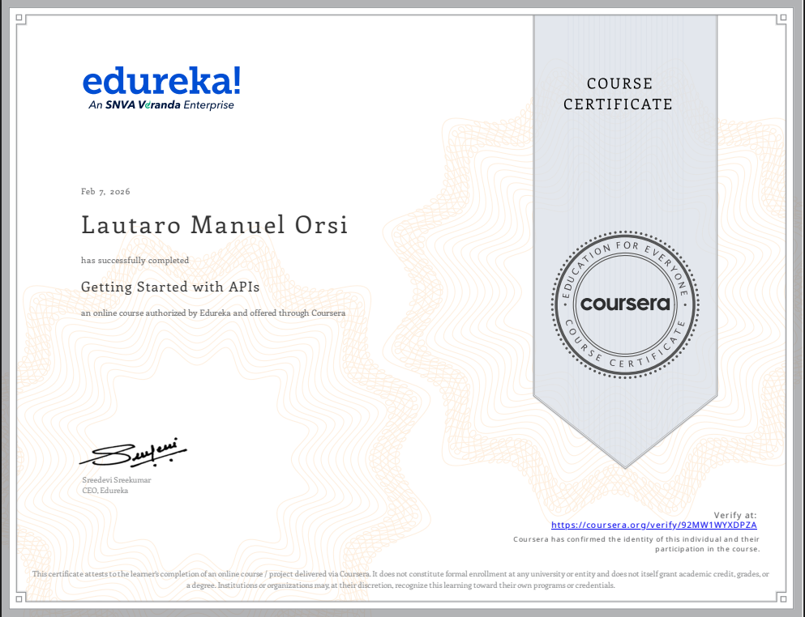

# About

This is the first module [Getting Started with APIs](https://www.coursera.org/learn/getting-started-with-apis), here I had an introduction to:

- **RESTful** API design principles (methods, status codes, routes)
- Clear [*Documentation*](./final_project/documentation.md) 
- Manual testing with **Postman** and automated testing via python scripts  

This module did NOT discuss security, authentication nor protection tools so this project assumes no bad actors get access to the endpoints.

# Certificate of Completion

[PDF](<Coursera 92MW1WYXDPZA.pdf>)